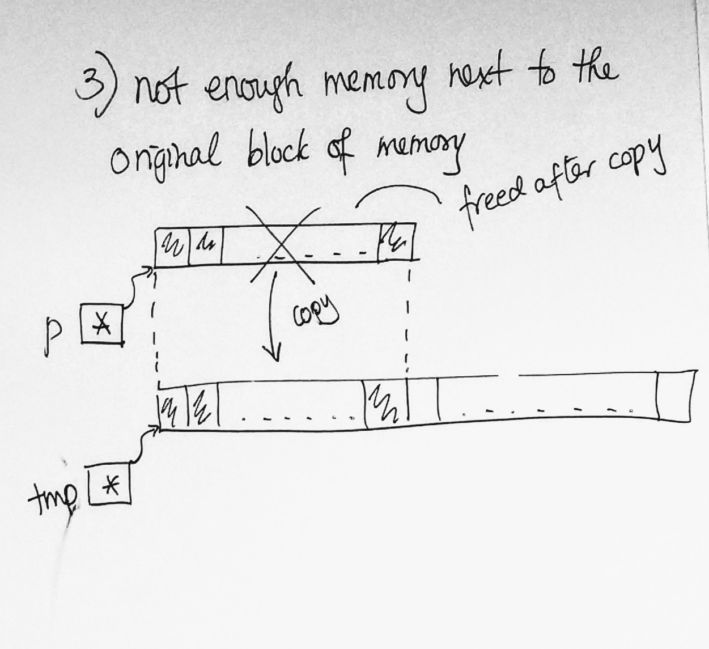
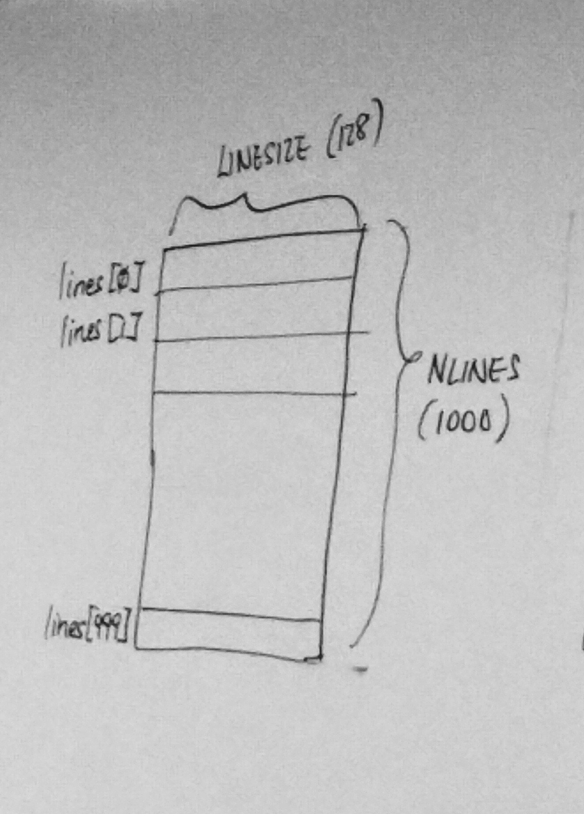
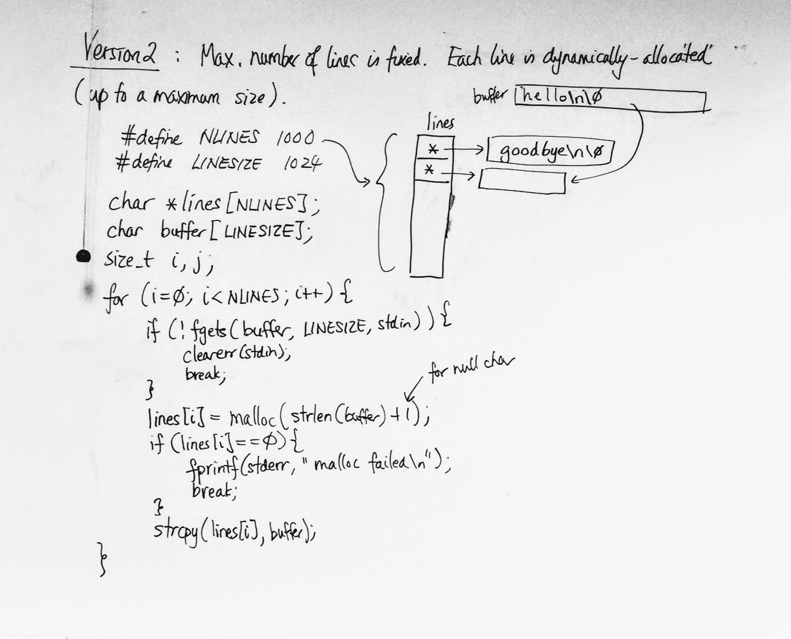

# C Notes - Day 13

------


[TOC]


----


#### Intro Example:

```c
int *p = malloc(100 * sizeof(int));

int *tmp = realloc(tmp, 200 * sizeof(int));
```


## 3 Possibilities:


1. realloc fails:

   | ///  | ///  | ///  | ///  |
   | ---- | ---- | ---- | ---- |
   | p*   |      |      |      |


2. there is enough next to the original block of memory

​										<— 100 Ints —> 											<— 100 Ints —>

| /L/                     | <- 100 ints -> | /L/  | /R/  | <-100 ints -> | /R/  |
| ----------------------- | -------------- | ---- | ---- | ------------- | ---- |
| p* and tmp* points here |                |      |      |               |      |


3. not enough memory next to the original block of memory




##### Special Case:

realloc(p, 0) == free(p)

realloc(0, size) == malloc(size)


#### Examples:

> Storing lines of text
>
> **3 versions**


> **Version 1:** 
>
> Using a 2-dimensional array

```c
#define NLINES 1000
#define LINESIZE 128

/* lines is an array of NLINES object each an array of LINESIZE chars */
char lines[NLINES][LINESIZE];
size_t i, j;

/* v1 */
while fgets(...) {
  ...
}

/* v2 (preferred version) */
for(i = 0; i < NLINES; i++) {
  if(!fgets(lines[i], LINESIZE, stdin)) {
    clearerr(stdin);
    break;
  }
  
  /* print back the lines */
  for(j = 0; j < i; j++) {
    printf("%s", lines[j]);
  }
  
}
```


### Disadvantages:

1. max number of lines the array can store is fixed at compile time
2. we may be wasting memory if most lines are short

 


> **Version 2:**
>
> Max number of lines  is fixed. Each line is dynamically-allocated
>
> (up to a maximum size)

```c
#define NLINES 1000
#define LINESIZE 1024

char *lines[NLINES];
char buffer[LINESIZE];

size_t i, j;

for(i = 0; i < NLINES; i++)
{
  if(!fgets(buffer, LINESIZE, stdin)) {
    clearerr(stdin);
    break;
  }
  
  /* allocate memory to store the line */
  /* the +1 is for the null character */
  lines[i] = malloc(strlen(buffer) + 1);
  
  /* everytime we do malloc, we do a check */
  if (lines[i] == 0) {
    fprintf(stderr, "malloc failed\n");
    break;
  }
  
  /* copy the line over */
  strcpy(lines[i], buffer);   
}

/* print back the lines */
for(j = 0; j < i; j++)
{
  printf("%s", lines[j]);
}

/* deallocate dynamic memory */
for(j = 0; j < i; j++)
{
  free(lines[j]);
}
```





> **Version 3:**
>
> Max number of lines can grow. Each line is dynamically-allocated

```c
char **lines;
size_t nalloc, nused, i;
char buffer[LINESIZE];

nalloc = nused = 0; lines = 0;

/* as long as we can read a line */
while(fgets(buffer, LINESIZE, stdin))
{
  /* if we have used up the allocated pointers */
  if(nused == nalloc) {
    char **tmp = realloc(lines, (nalloc + NLINES) * 			 		  sizeof(char *));
    if(tmp == 0) {
      fprintf(stderr, "realloc failed\n");
      break;
    }
    lines = tmp;
		nalloc += NLINES;
  }
  
  /* use the next free pointer */
  lines[nused] = malloc(strlen(buffer)+1);
  if(lines[nused] == 0) {
    fprintf(stderr, "malloc failed\n");
    break;
  }
  strcpy(lines[nused++], buffer);
}

/* print back the lines */
for(i = 0; i < nused; i++)
{
  printf("%s", lines[i]);
}

/* deallocate dynamic memory */
for(i = 0; i < nused; i++)
{
  free(lines[i]);
}
free(lines);
```


----


## qsort


#### Example:

```c
#include <stdlib.h>

int a[100];
/* assume we've stored 100 ints in a */
qsort(a, 100, sizeof(a[0]), cmp);
```

> **a** = array name
>
> **100** = number of elements
>
> **sizeof** = size of each element
>
> **cmp** = comparison function (used to specify the sorting order)
>
> 
>
> qsort can sort any type of array
>
> void qsort(void*, size_t,  )


### ⭐️ qsort calls cmp whenever it needs to compare 2 elements of the array


## Prototype of cmp:

```c
int cmp(const void*, const void*);
/* return negative value then first one is first */
/* return positive then second one goes first */
/* if 0 is returned then it doesn't matter */

/* example */
/* assume ai = 3, a4 = 7 */
cmp(&a[i], &a[4]);
```


