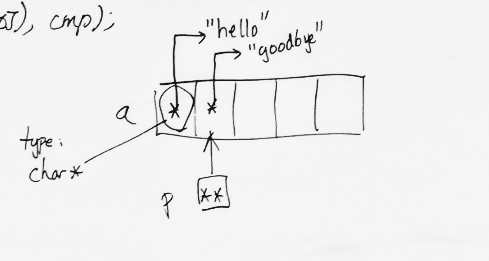
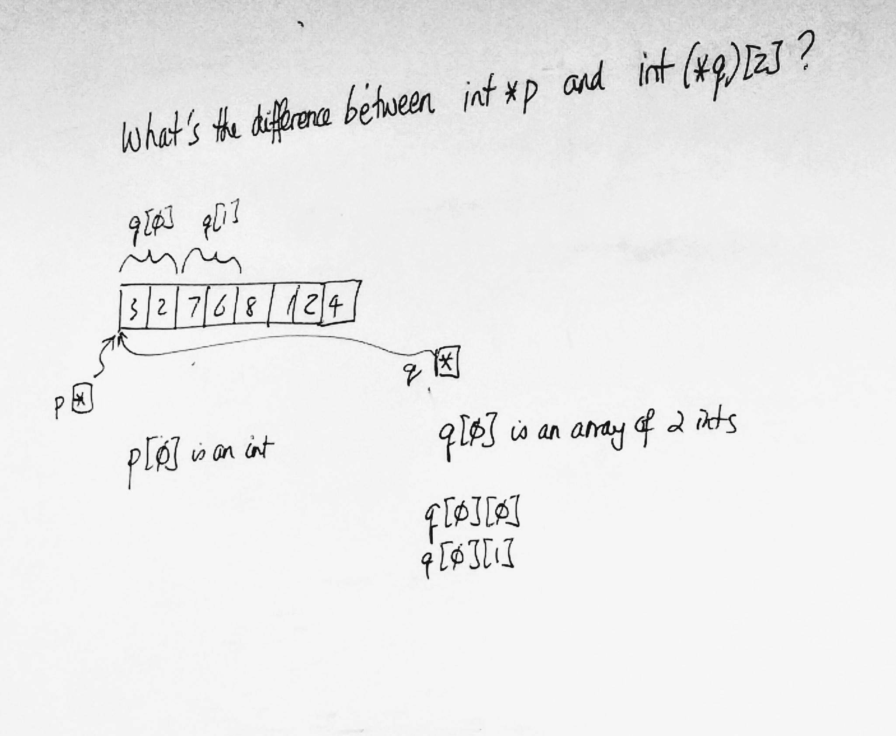
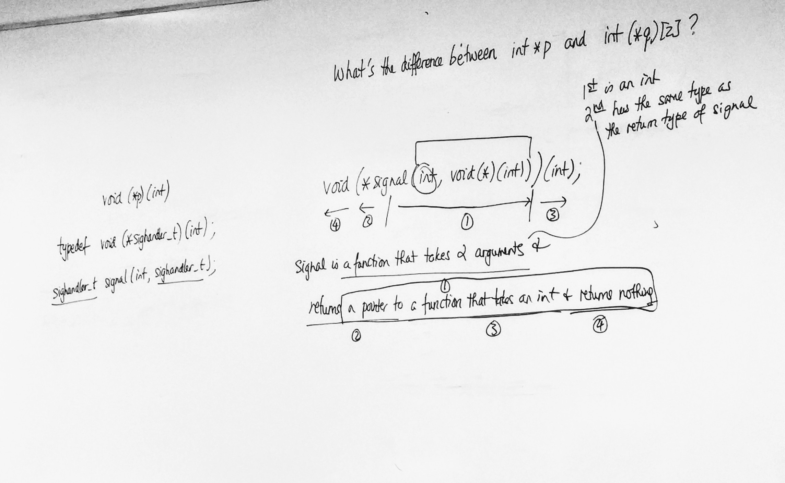

# C Notes - Day 14

------


[TOC]


----


#### Intro Example:

```c
int a[100];
qsort(a, 100, sizeof(a[0]), cmp);
```

> qsort calls cmp passing on the address as of the 2 elements it wants to compare


#### Examples:


> **Example 1:**

```c
/* sort in ascending order */
int cmp(const void *p, const void *q)
{
  const int *pp = p;
  const int *qq = q;
  
  /* ascending order */
  return *pp - *qq;
  
  /* for descending order, return *qq - *pp */
}
```

> cmp(p, q) should return a negative integer if *p should go before *q after sorting.
>
> cmp(p, q) should return a positive integer if *p should go after *q after sorting.
>
> cmp(p, q) should return a 0 if it does not matter which goes first.


```c
cmp(&x, &y) < 0 /* if x should before y */
```


> **Example 2:**

```c
typedef struct {
  char id [IDSIZE];
  int score;
} grade;

grade a[100];
/* assume we've stored 100 grades in a */
qsort(a, 100, sizeof(a[0]), cmp);
```


**Sorting Order:**

descending order of scores and if several grades have the same score, they are then sorted in ascending order of their IDs.

> descending is the primary sorting order
>
> ascending would be the secondary sorting order


⭐️ *qsort is not a stable sort*


**Example if sort IS stable:**

> monty burns
>
> homer simpson
>
> lisa simpson
>
> /* the order of equivalent elements is preserved. IE: simpson */


#### Example For Lab:

```c
int cmp(const void *p, const void *q)
{
  const grade *pp = p;
  const grade *qq = q;
  int n;
  
	n = qq->score - pp->score;
  
  if (n != 0) {
    return n;
  }
  
  return strcmp(pp->id, qq->id);
}
```


> **Example 3:**
>
> Sorting an "array of strings" in ascending order

```c
/* an array of pointers */
char *a[] = {"hello", "goodbye", "world", ....};

qsort(a, sizeof(a)/sizeof(a[0]), sizeof(a[0]), cmp);

int cmp(const void *p, const void *q)
{
	/* read right to left */
	char * const *pp = p;
	char * const *qq = q; 
  
  return strcmp(*pp, *qq);
}
```

> *pp is a pointer to a constant pointing to char





---


## Function Pointers


A function pointer is a variable that stores the address of a function.


We need to be able to:

1. declare a function pointer
2. find the address of a function
3. call a function via a function pointer


```c
void qsort(void x, size_t, size_t, ???);
```


### Address of a function


If f is a function, then we can use &f (or simply, f) as its address

> Example:
>
> ```C
> int f(int, int)
> {
>   ...
> }
> /* address is: &f or just f */
> ```


#### Calling a function via a pointer to it:

Suppose p points to int f(int, int);

> Example:
>
> ```C
> (*p)(1, 2); /* this calls f passing in 1 & 2 */
> /* or simply p(1, 2); */
> ```


### Declaring a function pointer:


#### Examples:


> Example 1:

```c
void f(int);
void (*p)(int) = f;
```


> Example 2:

```c
int g(int, int);
int (*q)(int, int) = g;
```


> Example 3:

```c
int f1(int);
int f2(int);

int (*a[])(int) = {f1, f2};

/* example: a[0](3) */
(*a[0])(3);
/* or simply */
a[0](3); /* calls f1 passing in 3 */

```


---


## Right-Left Rule


### Examples:


**Example 1:**

```c
void (*p)(int);
```

> 1. p is a
> 2. pointer to
> 3. function that takes an int
> 4. and returns nothing


**Example 2:**

```c
int (*a[2])(int, int);
```

> 1. a is an array of 2
> 2. pointers to
> 3. functions that take 2 ints
> 4. and returns an int


**Example 3:**

```c
char *const *p;
```

> 1. p is
> 2. a pointer to constant pointer to char


**Example 4:**

```c
int *a[2];
```

> 1. a is an array of 2
> 2. pointers to int


**Example 5:**

```c
int(*a)[5];
```

> 1. a is a pointer to
> 2. an array of 5
> 3. ints


##### What's the difference between int *p ...

##### … and int (*q)[2] ?




#### Example of a really complicated declaration:

```c
void(*signal(int, void(*)(int))(int);
```

> 1. signal is a function that takes 2 arguments
>
>    - 1st is an int
>    - 2nd has the same type as the return type of signal
>
>    
>
> 2. and returns a pointer to
>
> 3. a function that takes an int
> 4. and returns nothing




