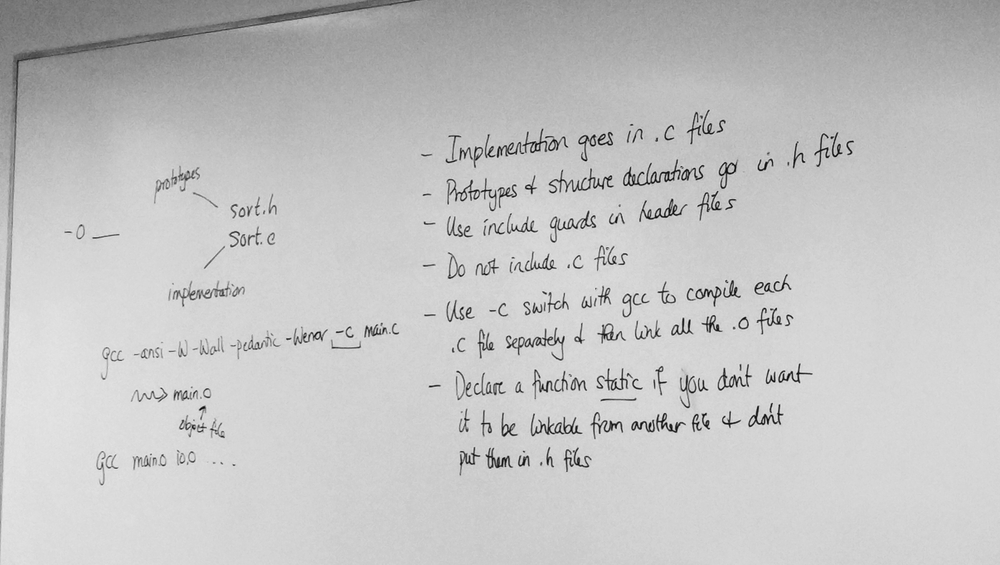
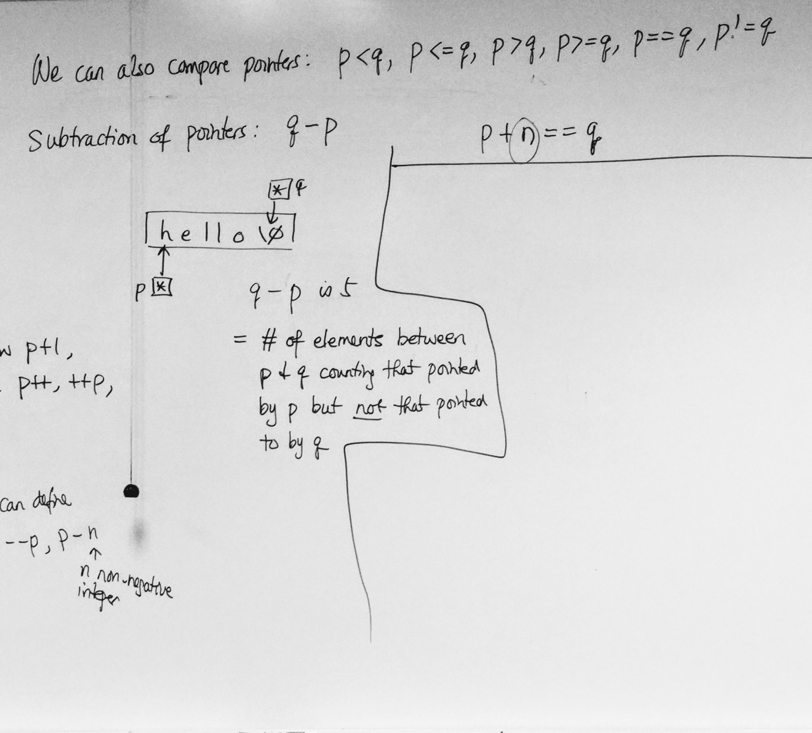
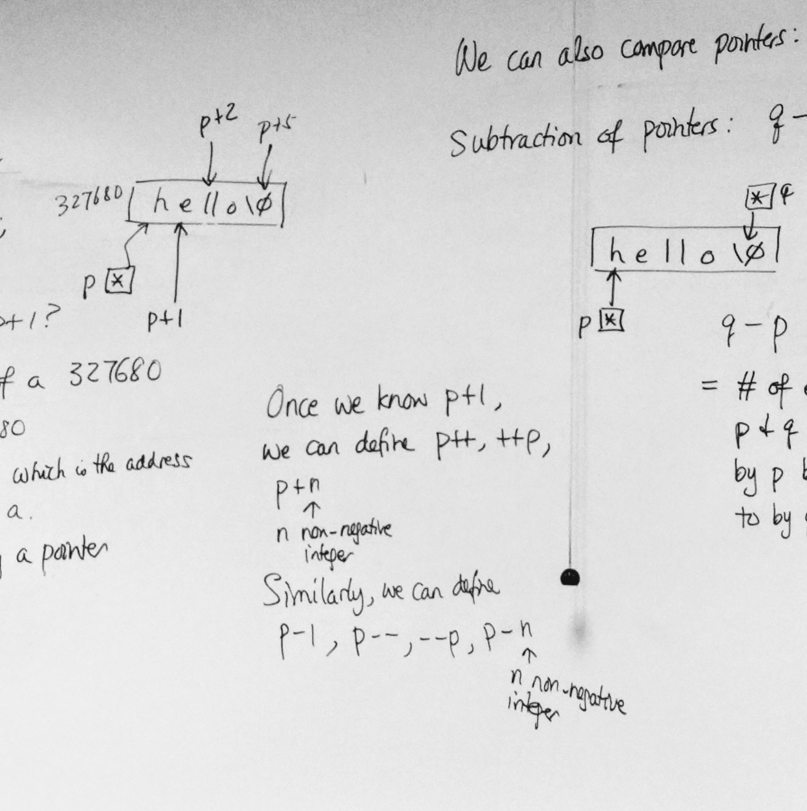

# C Notes - Day 15

------


[TOC]


---


#### In-Class Examples:


> original

```c
#include <stdio.h>
#include <stdlib.h>
#include <string.h>
#define IDSIZE 10

typedef struct {
  char id[IDSIZE];
  int score;
} grade;

int cmp(const void *p, const void *q) {
  const grade *pp = p;
  const grade *qq = q;
  return strcmp(pp->id, qq->id);
}

int read_record(grade *g) {
  return scanf("%s%d", g->id, &g->score) == 2;
}

void print_record(const grade *g) {
  printf("%s: %d\n", g->id, g->score);
}

void sort_asc_id(int *a, size_t n) {
  qsort(a, n, sizeof(a[0]), cmp);
}

int main (void)
{
  grade a[100];
  size_t i, j;
  
  for (i = 0; i < 100; i++) {
    if (!read_record(&a[i])) {
      break;
    }
    
    sort_asc_id(a, i);
    
    for (j = 0; j < i; j++) {
      print_record(&a[j]);
    }
    
    return 0;
  }
  
  return 0;
}
```


> main.c

```c
#include <stdio.h>
#include <stdlib.h>
#include <string.h>
#define IDSIZE 10
#include "grade.h"
#include "io.h"
#include "sort.h"

int main (void)
{
  grade a[100];
  size_t i, j;
  
  for (i = 0; i < 100; i++) {
    if (!read_record(&a[i])) {
      break;
    }
    
    sort_asc_id(a, i);
    
    for (j = 0; j < i; j++) {
      print_record(&a[j]);
    }
    
    return 0;
  }
  
  return 0;
}
```


```c
#ifndef GRADE_H
#define GRADE_H
#define IDSIZE 10

typdef struct {
  char id[IDSIZE];
  int score;
} grade;
#endif
```


> io.h

```c
#ifndef IO_H
#define IO_H
#include "grade.h"

int read_record(grade *g);
void print_record(const grade *g);
#endif
```

> **io.h :** contains the prototype
>
> must #include "io.h"


> io.c

```c
#include <stdio.h>
#include "io.h"

int read_record(grade *g) {
  return scanf("%s%d", g->id, &g->score) == 2;
}

void print_record(const grade *g) {
  printf("%s: %d\n", g->id, g->score);
}
```


> sort.h

```c
#include <stdio.h>
#include <stdlib.h>
#include "sort.h"

static int cmp(const void *p, const void *q) {
  const grade *pp = p;
  const grade *qq = q;
  return strcmp(pp->id, qq->id);
}

void sort_asc_id(int *a, size_t n) {
  qsort(a, n, sizeof(a[0]), cmp);
}
```


----


### Implementation goes in .c files


### Prototypes and structure declarations go in to .h files

> We must include ".h files" if we want to import those prototypes.


### Use include guards in header files

> Do not include .c files
>
> Only include .h files


### Use -c switch with gcc to compile each .c file seperately and then link all the .c files

> gcc -ansi -W -Wall -pedantic -Werror -c main.c


### Declare a function <u>static</u> if you don't want it to be linkable from another file and don't put them in .h files. 





----


## Static


### static has 2 meanings

1. If a local variable is declared <u>static</u>, its lifetime is extended to the duration of the program.


> **Example:**

```c
void f(void)
{
  static int n; /* static variables default to 0 */
  printf("%d\n", ++n);
}

f(); /* 1 */
f(); /* 2 */
f(); /* 3 */
```


2. If a function or an extended variable is declared static, it has static(internal) linkage i.e: it can't be linked from another file.


> **Examples:**
>
> file 1.c

```c
int n = 1; /* creates n */
```


> file 2.c

```c
extern int n; /* declares n */

void f(void)
{
  printf("%n", n);
}
```


---


## Pointer Arithmetic


#### Intro Example:

```c
char a[] = "hello";
char *p = a;

/* What is the value of p + 1? */
/* Assume starting address of a: 327680 */

/* Value of p is then 327680 */

/* 327681 : which is the address of 'e' in the array a */
p + 1;
```

> p + 1 : points to 'e' in "hello"
>
> **Note:**
>
> p + 1 is not really a pointer! (It is NOT a VARIABLE!!)


Once we know p + 1, we can define p++, ++p,

p + n where n is a non-negative integer.

Similarly, we can define p -1, p—, —p, p - n where n is a non-negative integer.


#### Comparison of pointers :

> p < q
>
> p <= q
>
> p > q
>
> p >= q
>
> p == q
>
> p != q





#### Subtraction of pointers :

> "hello\0"
>
> q - p
>
> q - p is 5 because p + n == q
>
> the number of elements between p and q counting that pointed by p but not that pointer to by q





----


### Standard Idiom to process a String (Pointer Version) :

> Assume s is the string we want to process

```c
/* sometimes we need a const sometimes we don't */
(const)char *p;

for (p = s, *p != '\0'; p++)
{
  /* process *p */
}
```


---


#### Examples:

1. Length of String

   ```c
   size_t str_length(const char *s)
   {
     const char *p;
     
     for (p = s; *p != '\0'; p++);
     return p - s; 
     
   }
   ```


2. Changing a String to all UpperCase

   ```c
   void str_uppercase(char *s)
   {
     char *p;
     for (p = s; *p != '\0'; p++)
       *p = toupper(*p);
   }
   ```

   > Note:
   >
   > p is not really needed.
   >
   > ```c
   > for (; *s != '\0'; s++)
   >   *s = toupper(*s);
   > ```


3. Looking for a character in a String

   ```c
   char * str_find(const char *s, int x)
   {
   	const char *p;
     for (p = s; *p != '\0'; p++)
       if (*p == x)
         return (char *)p;
     
     return 0;
   }
   ```


> C Library :

```c
/* C Library : */
char *strchr(const char *, int);
```


4. Copying a String

   > Version 1 :

   ```c
   void str_copy(char *dest, const char *src)
   {
     char *d;
     const char *s;
     for (d = dest, s = src; *s != '\0'; d++, s++)
       *d = *s;
     *d = *s; /* copy null character */
   }
   ```

   

   > Version 2 :
   >
   > (we don't really need d & s)

   ```c
   void str_copy(char *dest, const char *src)
   {
     for (; *src != '\0'; dest++, src++)
       *dest = *src; /* *dest++ = *src++ */
     *dest = *src;
   }
   ```

   

   > Version 3 :

   ```c
   void str_copy(char *dest, const char *src)
   {
     while (*src != '\0')
     {
       *dest++ = *src++;
     }
     *dest = *src;
   }
   ```

   

   > Version 4 :

   ```c
   void str_copy(char *dest, const char *src)
   {
     while ((*dest++ = *src++) != '\0');
   }
   ```

   

   > Version 5 :

   ```c
   void str_copy(char *dest, const char *src)
   {
     while ((*dest++ = *src++));
   }
   ```

   > This version will generate a warning from the compiler because it is using an assignment for a truth value.
   >
   > To eliminate warning you need to put parenthesis () around it.


