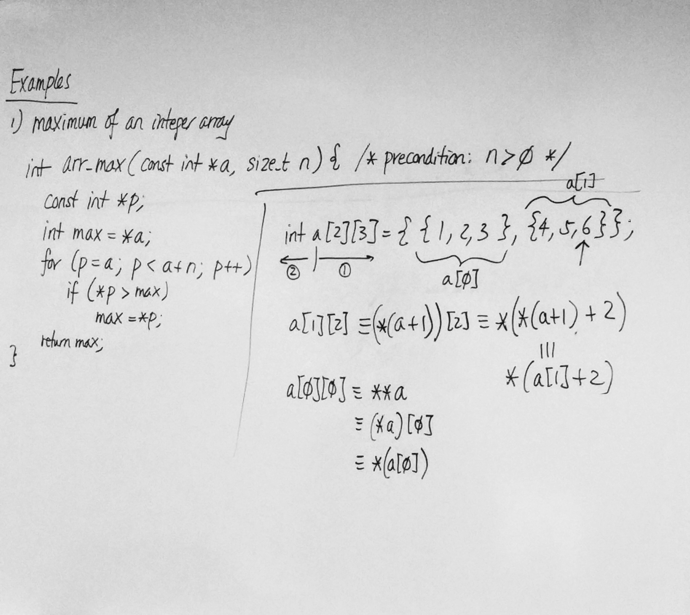
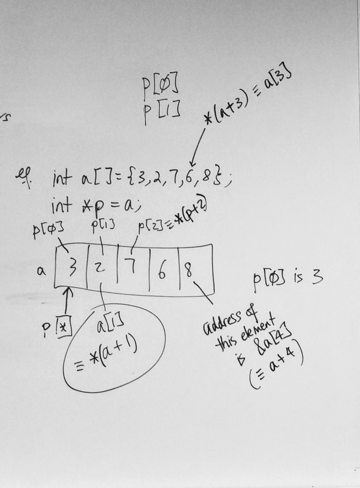
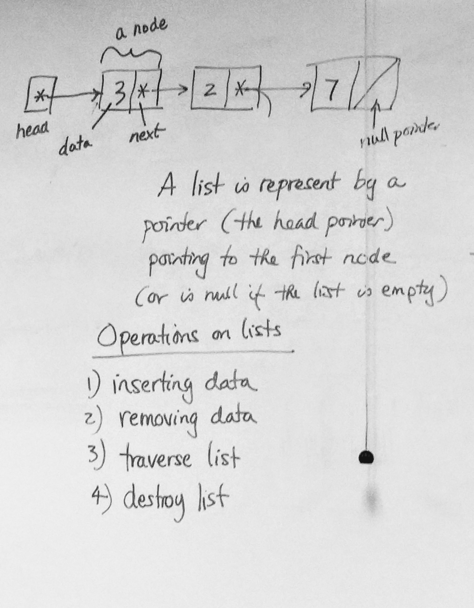
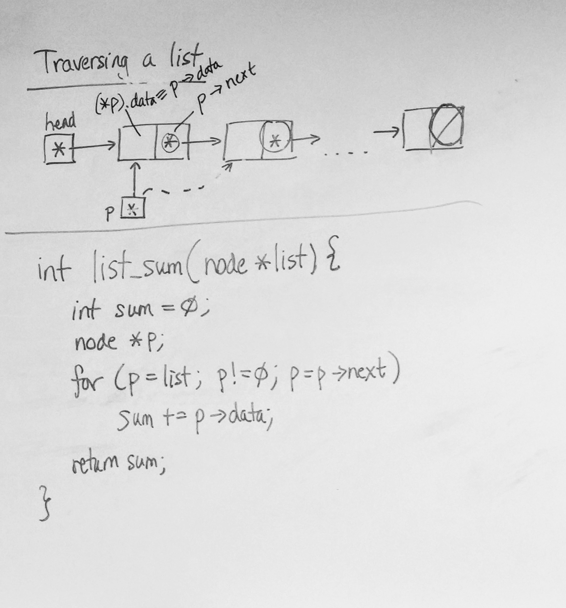

# C Notes - Day 16

---


[TOC]


------


### ⭐️ Note: There is no case-insensitive string comparison function in the standard ANSI C library.


---


## Continued Lesson from Day 15


```c
*p++ Is this (*p)++ or *(p++) ?
 
*p++ is equivalent to *(p++)
```


### Pointer Arithmetic with Arrays :

```c
int a[] = {3, 2, 7, 6, 8};
int *p = a;

/* What is the value of the of p + 1? */
/* Assume the value of 'a' is 655360 */

/* Again we can define p + n, ++p, p++ */
/* We can define p - 1, hence p - n, --p, p-- */
```

> **Answer for p + 1 :**
>
> 65536(4)
>
> Why '4' ? Because the size of integer is 4 and because pointer is pointing to an integer, adding +1 will give the address +4.


### Standard Idiom to process an Array (Pointer Version)

```c
T a[N];

(const)T *p;

for (p = a; p < a + N; p++)
  /* process *p */
```

> **T :** some type
>
> **N :** some positive integer


#### Examples :


1. Maximum of an integer array

   ```c
   /* pre-condition: n > 0 */
   int arr_max(const int *a, size_t n)
   {
     const int *p;
     int max = *a;
     
     for (p = a; p < a + n; p++)
     {
       if (*p > max)
         max = *p;
     }
     return max;
   }
   ```

   > 

   

2. Looking for an integer in an integer array

   ```c
   int *arr_find(const int *a, size_t n, int x)
   {
     const int *p;
     
     for (p = a; p < a + n; p++)
     {
       if (*p == x)
         return (int *)p;
     }
     return 0;
   }
   ```


---


## Equivalence of Pointer and Array notation


We can use pointer notations with arrays and we can also use array notations with pointers.


```c
x[n] = *(x + n);
&x[n] = x + n;
```


**Examples:**

```c
int a[] = {3, 2, 7, 6, 8};
int *p = a;

p[0]; /* 3 */

a[1]; is equivalent to *(a + 1); /* 2 */
  
p[2]; is equivalent to *(p + 2); /* 7 */

/* address of element in index 4 */
&a[4]; is equivalent to (a + 4);
```


> All of these refer to '6' in the array :

```c
/* a[0] and a[1] */
int a[2][3] = {{1, 2, 3}, {4, 5, 6}};

a[1][2] == (*(a + 1))[2] == *(*(a + 1) + 2);

/* or you can write it as */
*(a[1] + 2);
```

> More equivalents :

```c
a[0][0] == **a,
== (*a)[0],
== *(a[0]);
```





---


## Simply-linked Lists


- consists of nodes
- each node contains a data portion and a pointer to the following node
- there is a last node where the pointer to the following node is null


#### Example : List of integers

```c
struct node {
  int data;
  node *next;
};
```


A list is represented by a pointer (the head pointer) pointing to the first node (or is null if the list is empty).


### Operations on lists

1. inserting data
2. removing data
3. traverse list
4. destroy list





#### Traversing a List

```c
for (p = head; p != '\0'; p = p->next)
```


### Standard Idiom to process a Singly-Linked List

> Assume head is the head pointer of the list

```c
node *p;

for (p = head; p != 0; p = p->next)
{
  /* process *p which is the node */
}
```


#### Example

> Summing the integers in a list of integers :

```c
int list_sum(node *list) {
  int sum = 0;
  node *p;
  for (p = list; p != 0; p = p->next)
  {
    sum += p->data;
  }
  return sum;
}

int main (void)
{
  node *head = 0;
  /* insert data into list */
  
  printf("%d\n", list_sum(head));
}
```





#### Destroying a list

- Need to free all nodes in the list


### Standard Idiom to destroy a list

```c
/* head - head pointer */

node *p, *q;

for (p = head; p != 0; p = q)
{
 q = p->next;
 free(p);
}
```

