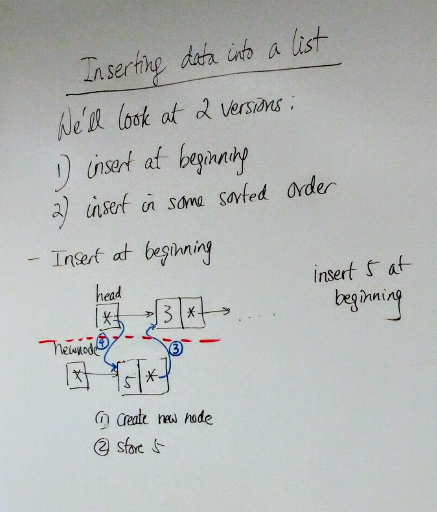
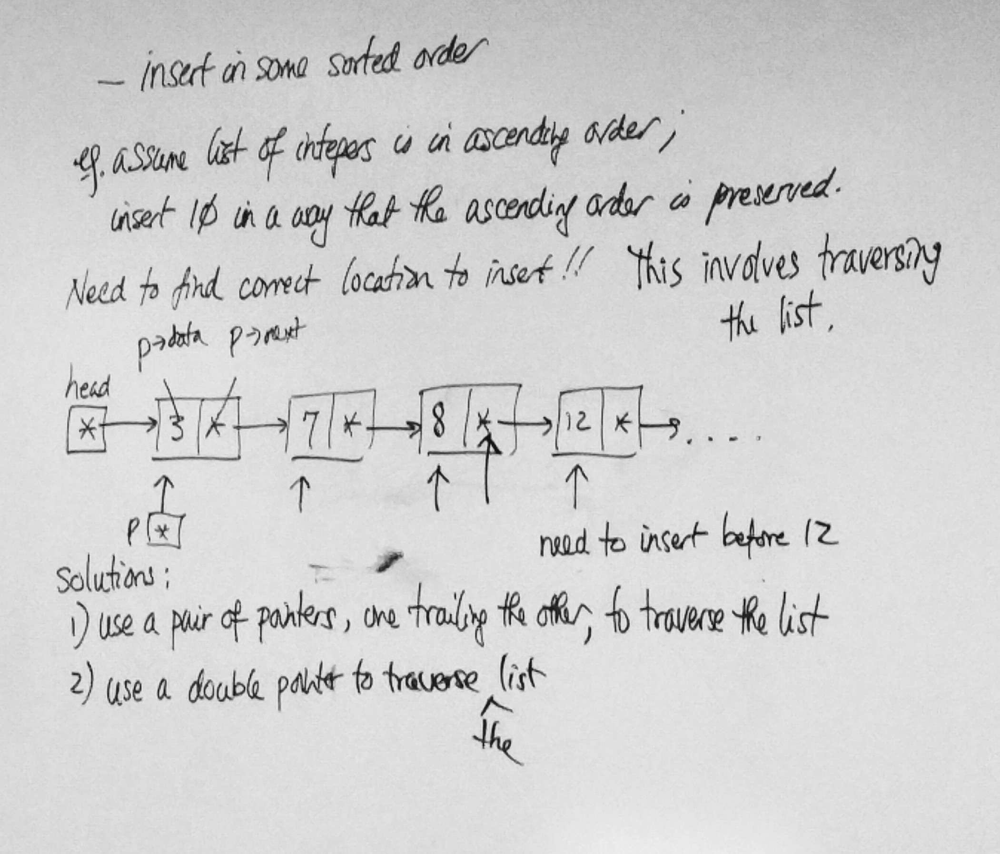
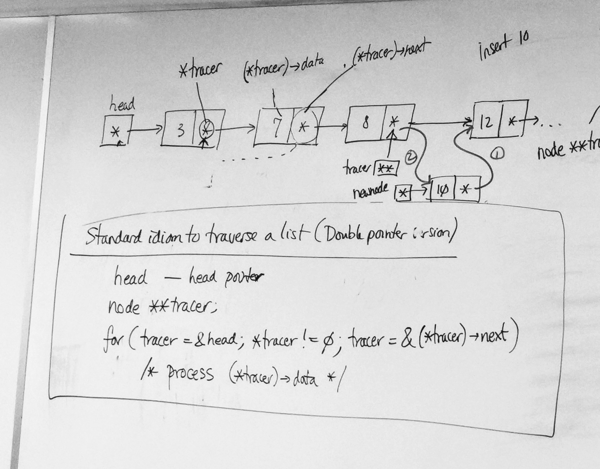
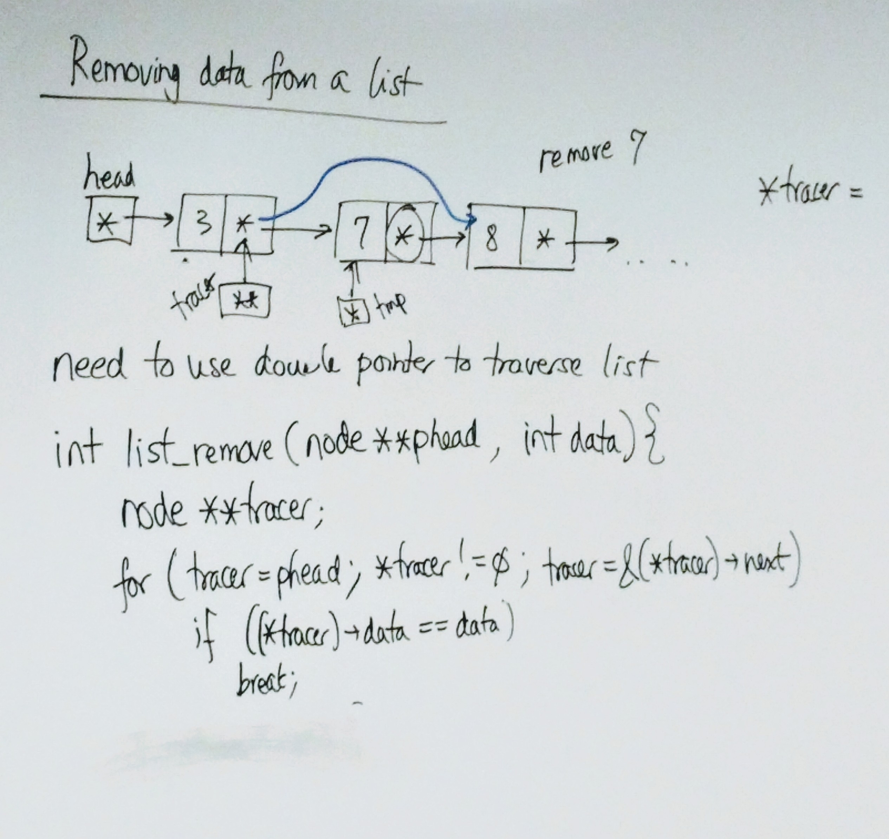

# C Notes - Day 17

------


[TOC]


---


## Inserting data into a list

We'll look at 2 versions :


1. Insert at beginning
2. Insert in some sorted order


#### Examples

> 1. Insert at beginning

```c
/* insert 5 at the beginning */
/* draft */

node *newnode = malloc(sizeof(node)); /* step 1 */

newnode->data = 5; /* step 2: store 5 */

newnode->next = head; /* step 3: assign head to next */

head = newnode; /* step 4: head is now the newnode */
```

> Put this in a function :

```c
int list_insert_head(node **phead, int data)
{
 node *newnode = malloc(sizeof(node));
  if (newnode == 0) {
    return 0;
  }
  newnode->data = data;
  newnode->next = *phead;
  *phead = newnode;
  return 1;
}

int main(void)
{
  /* call the function */
  /* pass the address when you call this function */
  list_insert_head(&head, 5); 
  return 0;
}
```





2. Insert in some sorted order

   > **Example:**
   >
   > - Assume list of integers is in ascending order;
   >
   > - Insert 10 in a way that the ascending order is preserved.
   >
   > - Need to find correct location to insert!! (this involves traversing the list)


**Solutions:**

1. Use a pair of pointers, one trailing the other, to traverse the list
2. Use a double pointer to traverse the list





---


### Standard Idiom to traverse a List (Double Pointer Version)

```c
/* assume head is head pointer */
node **tracer;
for(tracer = &head; *tracer != 0; tracer = &(*tracer)->next)
  /* process (*tracer)->data */
```





---


#### Example for Solution 2 :

> Insert in some order

```c
int list_insert_asc(node **phead, int data)
{
  node **tracer;
  node *newnode = malloc(sizeof(node));
  if (newnode == 0)
    return 0;
  
  newnode->data = data;
  for(tracer=phead; *tracer != 0; tracer=&(*tracer)->next)
    if((*tracer)->data >= data)
      break;
  
  newnode->next = *tracer;
  *tracer = newnode;
  return 1;
}
```


#### Examples:

> Removing data from a List
>
> - Need to use double pointer to traverse the list
> - NOTE : Don't de-reference a pointer unless you know it is (at least) not null

```c
int list_remove(node **phead, int data)
{
  node **tracer;
  for(tracer=phead; *tracer != 0; tracer=&(*tracer)->next) {
    if((*tracer)->data == data)
      break;
  }
  
  if(*tracer != 0) {
    node *tmp = *tracer;
    *tracer = tmp->next;
    free(tmp);
    return 1;
  }
  return 0;
}
```





----


## Can we print a simply-linked list backward?


### Recursion

```c
void reverse_print(node *head)
{
  if (head != 0) {
    reverse_print(head->next);
    printf("%d\n", head->data);
  }
}
```


---


## Binary Search Trees

- At each node, there are 2 subtrees (which may be empty)
- All data in the left subtree are less than the data in the node
- All data in the right subtree are greater than the data in the node


#### Example (BST)

> **Binary Search Tree of Integers**
>
> **Example:**
>
> Insert 100, 120, 110, 85, 90, 75, 130, 25 into an empty BST.

```c
typedef struct node node;

struct node {
  int data;
  node *left, *right;
};

/* A tree is represented by a pointer to its rest */
node *root = 0; /* empty tree */

```


### 3 ways to traverse a binary tree :


1. preorder : current node, left subtree, right subtree
2. inorder : left subtree, current node, right subtree
3. postorder : left subtree, right subtree, current node


#### Examples:

> BST

```c
void preorder(node *tree)
{
  if (tree != 0) {
    printf("%d\n", tree->data);
    preorder(tree->left);
    preorder(tree->right);
  }
}

void inorder(node *tree)
{
  if (tree != 0) {
    inorder(tree->left);
    printf("%d\n", tree->data);
    inorder(tree->right);
  }
}

/* post-order : exercise */
void postorder(node *tree)
{
  if (tree != 0) {
    postorder(tree->left);
    postorder(tree->right);
		printf("%d\n", tree->data);
  }
}
```


> **Destroying a Tree**
>
> - Need to traverse tree calling free for each node
> - Must use post-order traversal

```c
void tree_destroy(node *tree)
{
  if (tree != 0) {
    tree_destroy(tree->left);
    tree_destroy(tree->right);
    free(tree);
  }
}
```

