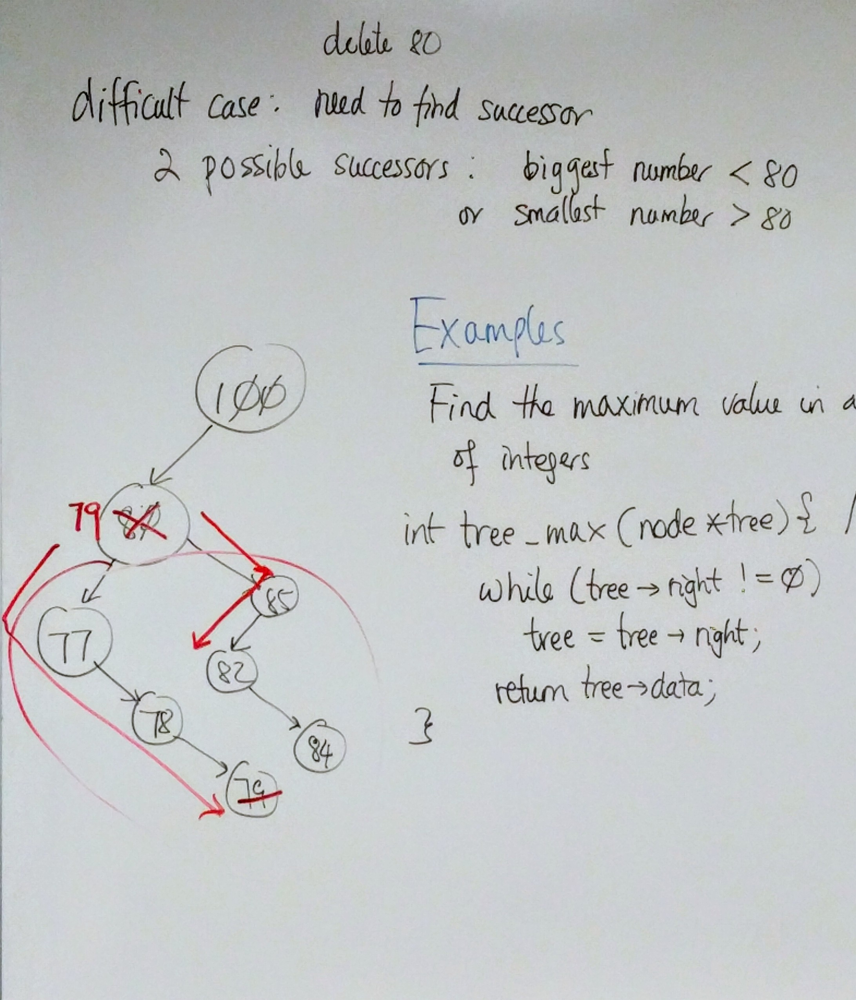
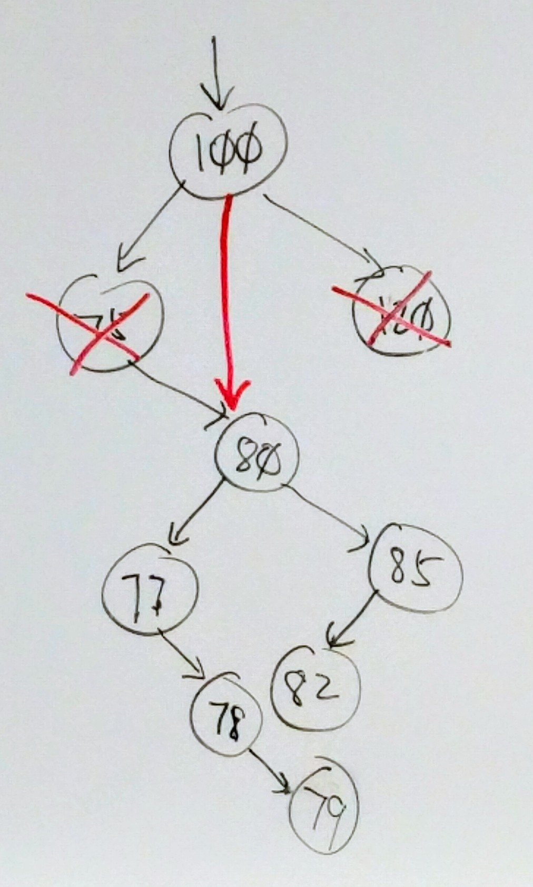
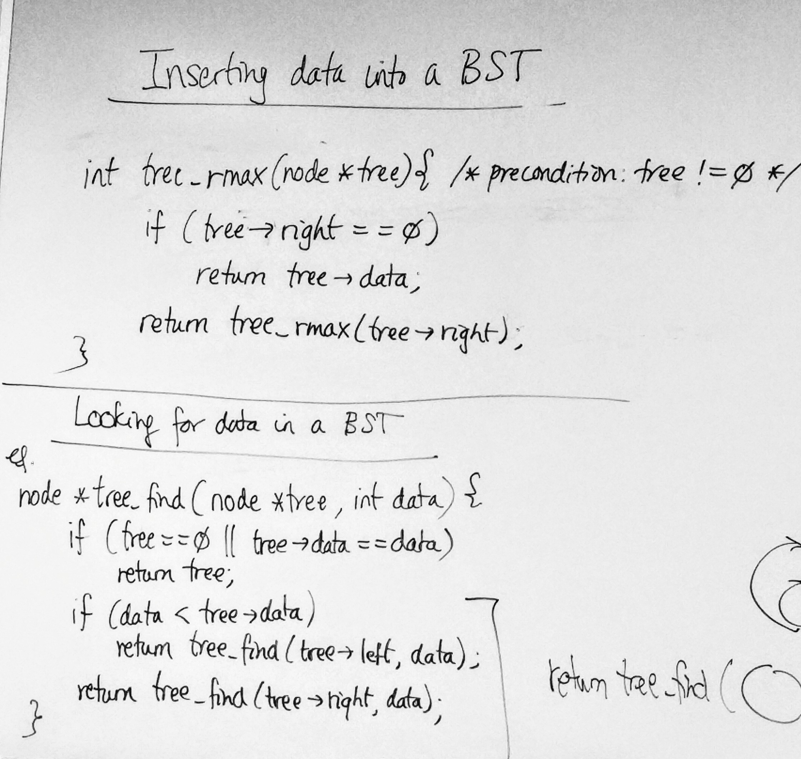

# C Notes - Day 18

------


## Inserting Data into a BST


> **Example:** BST of integers

```c
int tree_insert(node **ptree, int data)
{
  if (*ptree == 0) {
    node *newnode = malloc(sizeof(node));
    if(newnode == 0) {
      return 0;
    }
    newnode->data = data;
    newnode->left = newnode->right = 0;
    *ptree = newnode;
    return 1;
  }
  
  if (data < (*ptree)->data) {
    return tree_insert(&(*ptree)->left, data);
  }
  
  if (data > (*ptree)->data) {
    return tree_insert(&(*ptree)->right, data);
  }
  
  /* return 0 if duplcates are found */
  return 0;
  
}

node *root = 0;
tree_insert(&root, 3);
```


## Deleting data from a BST





**3 Cases:**

1. trivial case : delete 120 (no subtrees)

2. easy case : delete 75 (1 subtree)

3. difficult case : delete 80 (2 subtrees) : (need to find successor)

   > **2 possible successors :**
   >
   > 1. biggest number < 80
   > 2. smallest number > 80





---


#### Examples


> Find the maximum value in a BST of integers
>
> **Version 1**

```c
/* pre-condition : tree != 0 */
int tree_max(node *tree)
{
  while(tree->right != 0) {
    tree = tree->right;
  }
  return tree->data;
}
```


> Find the maximum value in a BST of integers
>
> **Version 2** 
>
> **(Recursive Version)**

```c
/* pre-condition : tree != 0 */
int tree_rmax(node *tree)
{
  if (tree->right == 0) {
    return tree->data;
  }
  return tree_rmax(tree->right);
}
```


---


#### Examples (Incrementing Pointers)

```c
*++p == *(++p);
++*p == ++(*p);

*p++ == *(p++);

/* these two are not equivalent */
(*p)++ != *p++;
```


```c
int a[] = { 11, 14, 17 };
int *p = &a[1];

/* case 1 */
printf("%d", *p++); /* 14 */
printf("%d", *p); /* 17 */

/* case 2 */
printf("%d", *++p); /* 17 */
printf("%d", *p); /* 17 */

/* case 3 */
printf("%d", (*p)++); /* 14 */
printf("%d", *p); /* 15 */
```


---


## Looking for data in a BST


```c
node* tree_find(node *tree, int data)
{
  if (tree == 0 || tree->data == data)
    return tree;
  
  if (data < tree->data)
    return tree_find(tree->left, data);
  
  return tree_find(tree->right, data);
}
```



