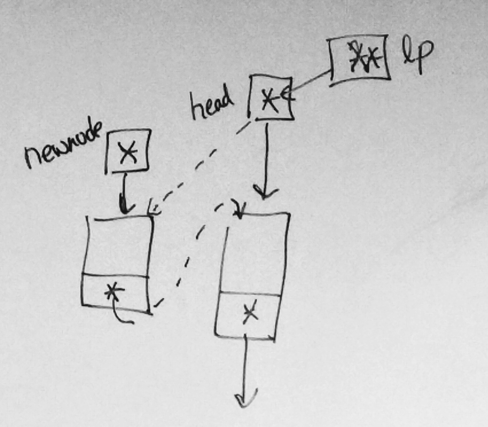
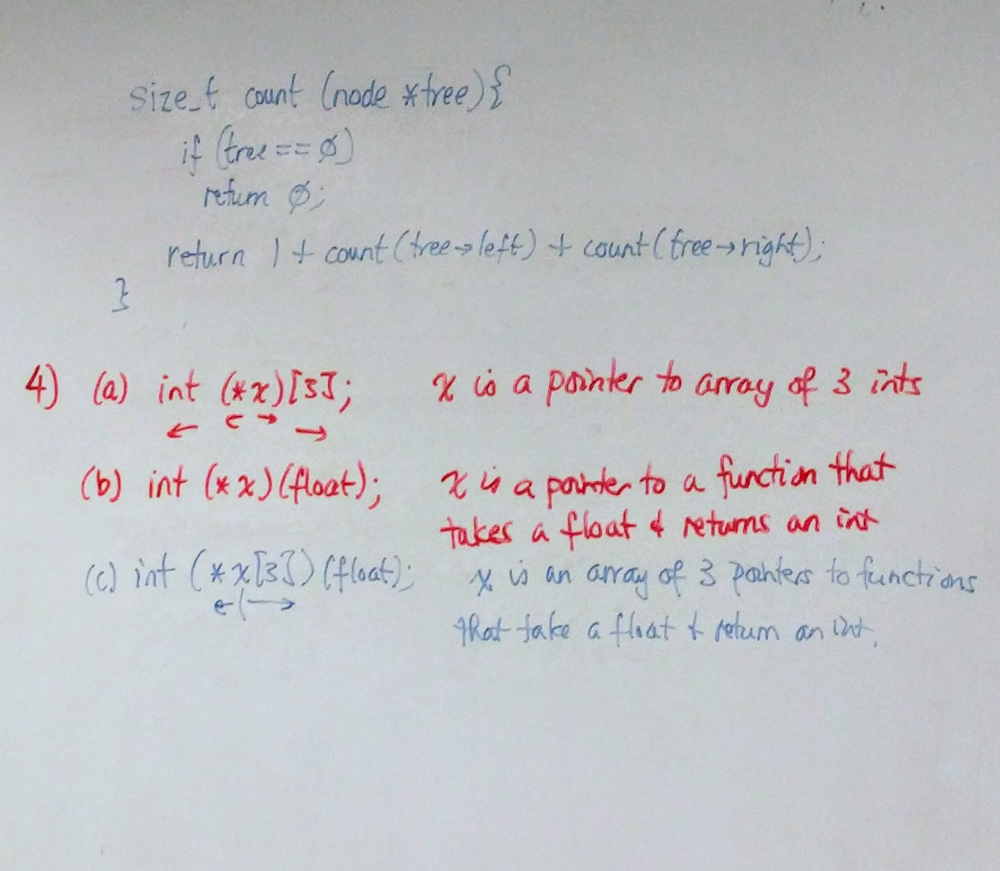
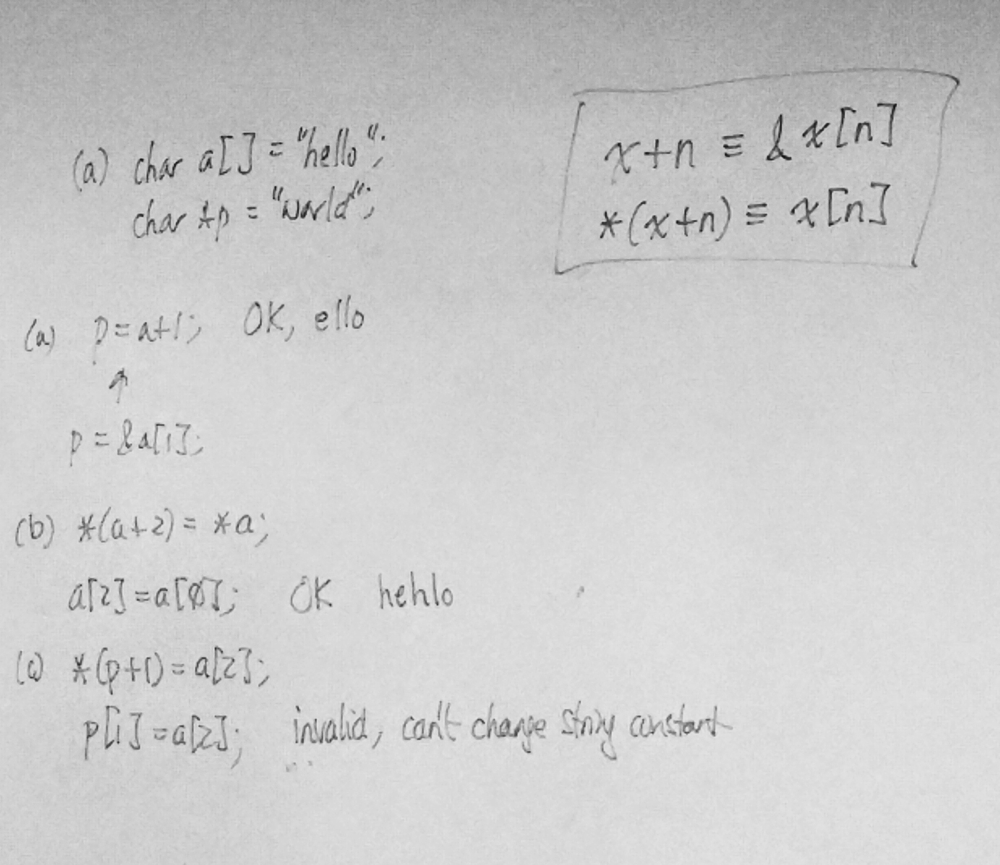

# Finals - Review Exercise 3

----


## [ 1 ] :

> (a) Write a C function print with prototype

```c
/* a */
void print(list lst)
{
  node *p;
  for (p = lst; p != 0; p = p->next)
    printf("%s : %d\n", p->data.name, p->data.score);
}
```


> (b) Write a C function find with prototype

```c
/* b */
node *find(list lst, const char *name)
{
  node *p;
  for (p = lst; p != 0; p = p->next)
    if (strcmp(p->data.name, name) == 0)
      return p;
  
  return 0;
}
```


> (c) Write a C function destroy with prototype

```c
/* c */
void destroy(list list)
{
  node *p, *q;
  for (p = lst; p != 0; p = q)
  {
    q = p->next;
    free(p);
  }
}
```


> (d) Write a C function insert with prototype

```c
/* d */
int insert(list *lp, const char *name, int score)
{
  node *newnode = malloc(sizeof(node));
  if (newnode == 0)
    return 0;
  
  strcpy(newnode->data = data.name);
  newnode->data.score = score;
  
  newnode->next = *lp;
  *lp = newnode;
  
  return 1;
}
```





---


## [ 2 ] :

> (a) Array is sorted in descending order of scores

```c
int cmp(const void *p, const void *q)
{
  const record *pp = p;
  const record *qq = q;
  
  return qq->score - pp->score;
}
```


> (b) Array is sorted in ascending order of names & if several records have the same name, they are sorted in descending order of their scores

```c
int cmp(const void *p, const void *q)
{
  const record *pp = p;
  const record *qq = q;
  
  int n;
  
  if ((n = strcmp(pp->name, qq->name) != 0))
    return n;
  
  return qq->score - pp->score;
}
```


---


## [ 3 ] :

> Binary Trees

```c
size_t count(node *tree)
{
  if (tree == 0)
    return 0;
  
  return 1 + count(tree->left) + count(tree->right);
}
```


----





---


## [ 4 ] :

> Right Left Rule

```C
/* a */
int (*x)[3];

/* b */
int (*x)(float);

/* c */
int (*x[3])(float);
```

> (a) : x is a pointer to array of 3 ints
>
> (b) : x is a pointer to a function that takes a float & returns an int
>
> (c) : x is an array of 3 pointers to functions that take a float & return an int


---


## [ 5 ] :

> INVALID / VALID Exercise

```c
/* a */
char a[] = "hello";
char *p = "world";
p = a + 1; /* equiv to p = &a[1]; */
printf("%s", p); /* OK; ello */

/* b */
char a[] = "hello";
*(a + 2) = *a; /* equiv to a[2] = a[0] */
printf("%s", a); /* OK; hehlo */

/* c */
char a[] = "hello";
char *p = "world";
*(p + 1) = a[2]; /* equiv to p[1] = a[2] */
printf("%s", p); /* INVALID!! */
```

> (a) : ello
>
> (b) : hehlo
>
> (c) : INVALID; Can't Change String Constant!!




